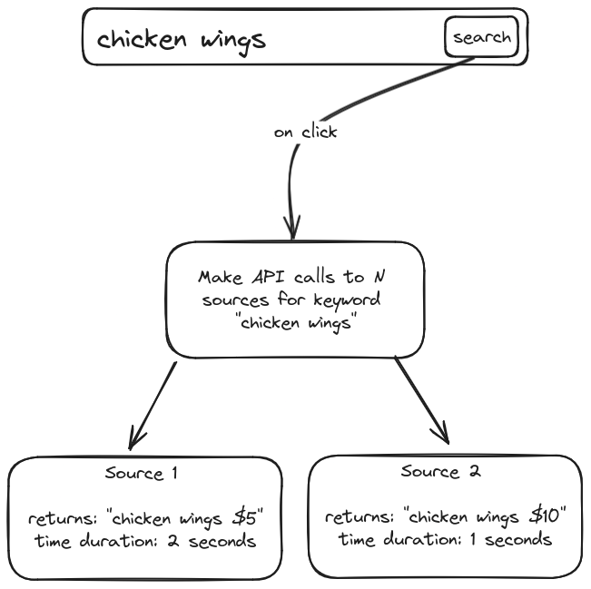
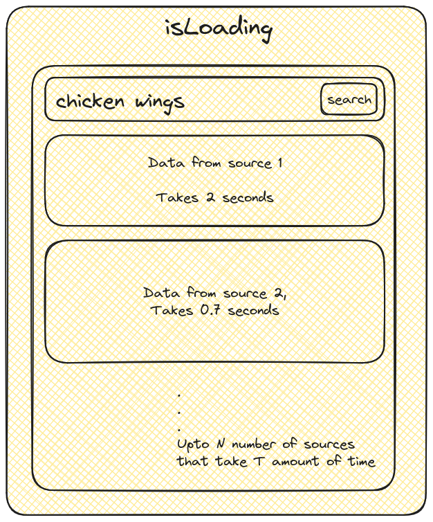

## The Premise 
We've come a long way since we wrote the first line of software. The premise of building software has always been simple; automate or solve a problem. 

From creating straight forward inventory software that ran locally on machines to cloud infrastructure, there's one thing that has always remained constant while building software.

```bash
States
```

A rudimentary definition of what a state is can be understood as the value of variables at any given point in time that is stored in the memory. This essentially means that the value of these variables represent the application's `state`  at the time of observation. 

The concept of states laid the foundation of modern software development and as the time progressed,  technologies came and went - the concept of states stayed with us, more or less the same. 

Fast forward to today, we have state managers that help us persist and maintain our application's state in a much more convinient and an abstracted way. The scope of this blog will involve `Pinia`. 

Pinia is a state manager for NUXT, and it functions the same way as Redux. We create a global store which can be consumed by the components that actually need that data at point of the application life cycle, and saves us from the prop-drilling hell. 

But I recently came across a really interesting issue which I had to resolve and I realized that maintaining states with a `store` isn't enough. 

There needs to be a structure on how we maintain these states, and this brought me to the following conclusion

> _'There needs to be an internal state handler, which will handle the states declared in my store'_

## State Management

I love the concept of having a global store, which I can access from any where, and so far I haven't really had any problems with this architecture until on Thursday, June 27th 2024.

## The Problem

Consider the following component for an online food ordering website. 

I search for 'chicken wings' in the search input and click search. 

I now expect results for chicken wings, and for this example lets assume that the data will come from different sources, and each source will have a card for itself. 


Here, we will make API calls to each source to request data for the search query when the user clicks the `search` button. 

Lets understand the same with a diagram to register this as well. 



This is where the problem begins to trickle down, but to understand the problem, lets and handle the state for this component. 

### The Internal States
Let us understand the possible states we should/can handle to make the user experience better

#### Loading State
The first thing we'd like to implement is a loader i.e. whenever there is an API call, and new data is being fetched - we want the user to see a loader.

#### Success State 
Once the data has been fetched, we'd like to show that to the user. For the sake of simplicity we will assume that that the reponse from the API is a JSON object that contains just two strings, which is the price of chicken wings from this particular source and a name.

```JSON
{
  name:'Chicken Wings',
  price: '$5'
}
```

#### Failed State
Since we're handling a success state, it is obvious that we need to handle a failed state as well.

We're making an network request to an external source, and it is possible that the the request might break in the future or not return anything at all. 

So in a nutshell we have to maintain three states: 
- Loading 
- Success 
- Failed

Pretty simple, so the general appraoch would be to create a boolean value called:

`isLoading`

Now understand that this boolean value defines the state of the entire component. 



The general approach here would be to set isLoading to true whenever we request data from an API and once the fetch is complete, we set `isLoading` to false.

If we have the data, we render it to the UI - this is our `success` state otherwise we show an error or don't show the card in our UI at all - this is our `failed` state. 

Fundamentally this will work, but the caveat here is that it will work as long as there in one source of data. 

*This is our problem*

Let's dive a little deeper to understand why this is a problem.


### The UI 
On the frontend we recieve an array of data which we parse into our component as props.

Here's what the data that we are passing to our component looks like: 

```ts
response: [
  {
    name:'Chicken Wings',
    price: '$5'
  },
  {
    name:'Chicken Wings Spicy',
    price: '$10'
  }
]
```

One the UI front, we will render the cards inside a for loop which runs for the length of the response of the array.

Now look at the diagram below. 


We will be making separate API calls to get the from these two sources, and each of these API calls will take their own time, and will return their own data.

There is a possibility that source-1 might return some data in 2 seconds while source might not return data at all even after 10+ seconds. 

But from our current appraoch, `isLoading` state governs the entirety of the component. 

Each API call we make will update the same `isLoading` variable and, if any of the APIs take, let's say maximum of T amount of time, our component will be visible to us after that time even though we had data which we could show to the user from other sources. 

This leads to bad user experience. 

One might argue that we can simply make two different isLoading variables for each of the sources we are making a call.

> But if have _`n`_ number of sources will we make _`n`_ number of `isLoading` variables in our store to govern our differnent API calls?


